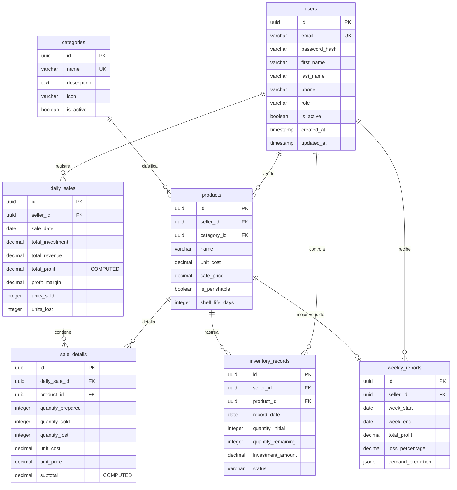

# Diagrama Entidad-Relación — TienditaCampus

```mermaid
erDiagram
    users ||--o{ products : "vende"
    users ||--o{ daily_sales : "registra"
    users ||--o{ inventory_records : "controla"
    users ||--o{ weekly_reports : "recibe"
    
    categories ||--o{ products : "clasifica"
    
    products ||--o{ sale_details : "detalla"
    products ||--o{ inventory_records : "rastrea"
    products ||--o| weekly_reports : "mejor vendido"
    
    daily_sales ||--o{ sale_details : "contiene"

    users {
        uuid id PK
        varchar email UK
        varchar password_hash
        varchar first_name
        varchar last_name
        varchar phone
        varchar role
        boolean is_active
        timestamp created_at
        timestamp updated_at
    }

    categories {
        uuid id PK
        varchar name UK
        text description
        varchar icon
        boolean is_active
    }

    products {
        uuid id PK
        uuid seller_id FK
        uuid category_id FK
        varchar name
        decimal unit_cost
        decimal sale_price
        boolean is_perishable
        integer shelf_life_days
    }

    daily_sales {
        uuid id PK
        uuid seller_id FK
        date sale_date
        decimal total_investment
        decimal total_revenue
        decimal total_profit "COMPUTED"
        decimal profit_margin
        integer units_sold
        integer units_lost
    }

    sale_details {
        uuid id PK
        uuid daily_sale_id FK
        uuid product_id FK
        integer quantity_prepared
        integer quantity_sold
        integer quantity_lost
        decimal unit_cost
        decimal unit_price
        decimal subtotal "COMPUTED"
    }

    inventory_records {
        uuid id PK
        uuid seller_id FK
        uuid product_id FK
        date record_date
        integer quantity_initial
        integer quantity_remaining
        decimal investment_amount
        varchar status
    }

    weekly_reports {
        uuid id PK
        uuid seller_id FK
        date week_start
        date week_end
        decimal total_profit
        decimal loss_percentage
        jsonb demand_prediction
    }
```
