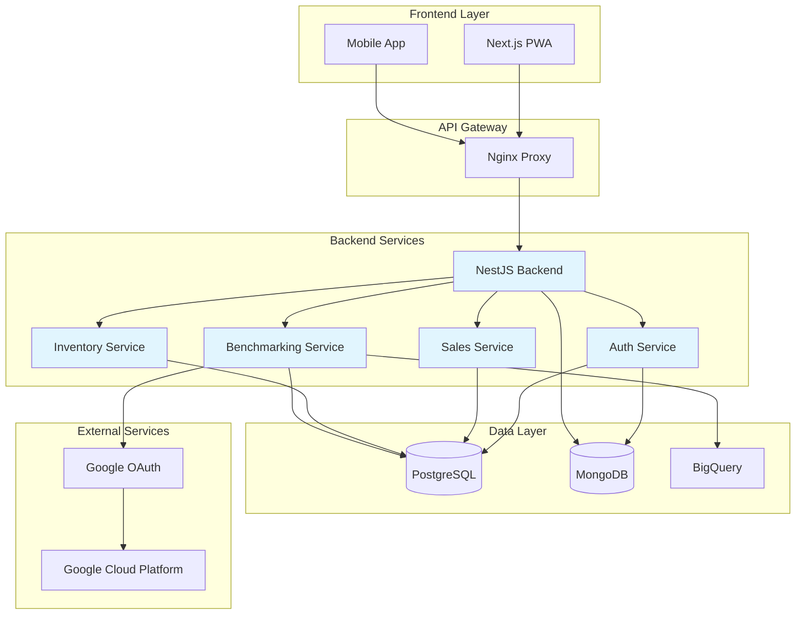
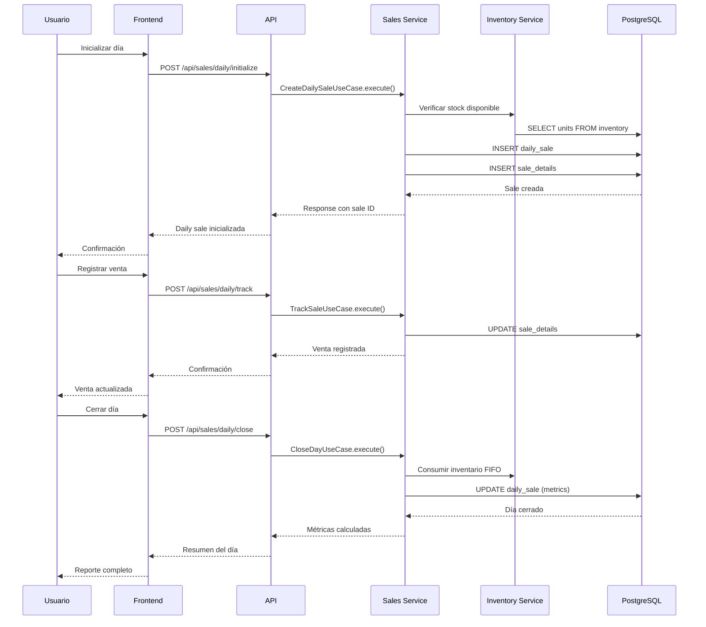
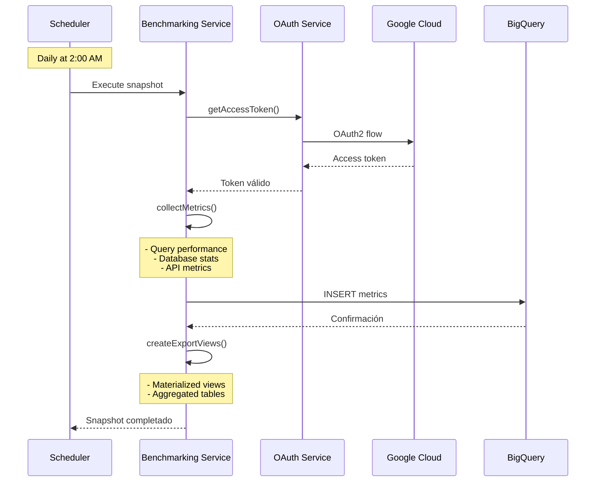
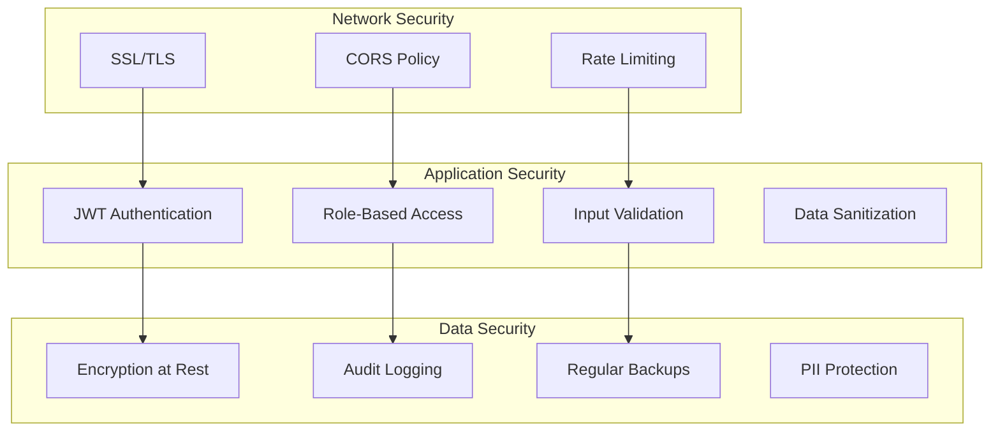
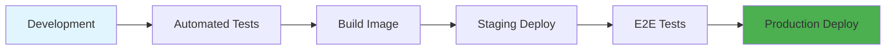

# Arquitectura del Sistema

## 🏗️ Overview General

TienditaCampus implementa una arquitectura de microservicios altamente escalable con separación clara de responsabilidades y capacidades de benchmarking avanzado.

## 📊 Diagrama de Arquitectura



## 🔧 Componentes Principales

### 1. Frontend (Next.js 14 PWA)
- **Progressive Web App**: Experiencia nativa en navegador
- **Server-Side Rendering**: Optimización SEO y rendimiento
- **Real-time Updates**: WebSocket integration
- **Offline Support**: Service Workers para modo offline

### 2. Backend (NestJS)
- **TypeScript**: Tipado estricto para robustez
- **Modular Architecture**: Desacoplamiento por dominios
- **Dependency Injection**: Inversión de control
- **Middleware Pipeline**: Validación, autenticación, logging

### 3. Base de Datos Principal (PostgreSQL 16)
- **ACID Compliance**: Integridad transaccional
- **JSONB Support**: Datos flexibles y estructurados
- **pg_stat_statements**: Métricas de rendimiento
- **Partitioning**: Escalabilidad horizontal

### 4. Auditoría (MongoDB)
- **Document Storage**: Esquema flexible para logs
- **Time Series**: Optimizado para datos temporales
- **Replica Set**: Alta disponibilidad
- **Aggregation Pipeline**: Análisis en tiempo real

## 📋 Módulos de Negocio

### Auth Module
```typescript
@Module({
  imports: [JwtModule, PassportModule, UsersModule],
  controllers: [AuthController],
  providers: [AuthService, JwtStrategy, GoogleOAuthService],
  exports: [AuthService],
})
```

**Responsabilidades:**
- Autenticación JWT con refresh tokens
- OAuth2 con Google Workspace
- Validación de usuarios y roles
- Session management seguro

### Sales Module
```typescript
@Module({
  imports: [TypeOrmModule.forFeature([DailySale, SaleDetail]), InventoryModule],
  controllers: [SalesController],
  providers: [SalesService, SalesRepository, CreateDailySaleUseCase],
  exports: [SalesService],
})
```

**Responsabilidades:**
- Ciclo completo de ventas diarias
- Cálculo de métricas en tiempo real
- Integración con inventario FIFO
- Análisis predictivo IQR

### Benchmarking Module
```typescript
@Module({
  imports: [HttpModule, ConfigModule],
  controllers: [BenchmarkingController],
  providers: [BenchmarkingService, OAuthBigQueryService, SnapshotService],
  exports: [BenchmarkingService],
})
```

**Responsabilidades:**
- Exportación automática a BigQuery
- Análisis de rendimiento de queries
- Métricas de uso del sistema
- OAuth con Google Cloud

## 🗄️ Flujo de Datos

### 1. Flujo de Ventas


### 2. Flujo de Benchmarking


## 🔐 Arquitectura de Seguridad

### 1. Capas de Seguridad


### 2. Gestión de Identidad
- **JWT Access Tokens**: 15 minutos de validez
- **JWT Refresh Tokens**: 7 días de validez
- **Google OAuth**: Integración SSO
- **Role Hierarchy**: Admin > User > Viewer

### 3. Auditoría Completa
```typescript
interface AuditLog {
  userId: string;
  action: string;
  resource: string;
  timestamp: Date;
  ip: string;
  userAgent: string;
  result: 'success' | 'failure';
  details?: Record<string, any>;
}
```

## 📈 Métricas y Monitoring

### 1. Application Metrics
- **Response Time**: P50, P95, P99
- **Throughput**: Requests per second
- **Error Rate**: Percentage por endpoint
- **Concurrent Users**: Active sessions

### 2. Database Metrics
```sql
-- Query performance analysis
SELECT 
  query,
  calls,
  total_exec_time,
  mean_exec_time,
  stddev_exec_time,
  rows,
  100.0 * shared_blks_hit / nullif(shared_blks_hit + shared_blks_read, 0) AS hit_percent
FROM pg_stat_statements 
ORDER BY total_exec_time DESC 
LIMIT 20;
```

### 3. Business Metrics
- **Daily Revenue**: Ingresos por día
- **Average Order Value**: Ticket promedio
- **Product Velocity**: Rotación de inventario
- **Waste Percentage**: Merma por producto

## 🚀 Escalabilidad

### 1. Horizontal Scaling
- **Load Balancer**: Nginx con múltiples backends
- **Database Replication**: Master-slave PostgreSQL
- **Caching Layer**: Redis para sesiones y caché
- **CDN**: Static assets distribuidos

### 2. Vertical Scaling
- **Resource Monitoring**: CPU, Memory, I/O
- **Auto-scaling**: Basado en métricas de carga
- **Connection Pooling**: PgBouncer para PostgreSQL
- **Index Optimization**: Queries optimizadas

## 🔧 Configuración de Entorno

### Development
```yaml
# docker-compose.dev.yml
services:
  backend:
    build:
      context: ./backend
      target: development
    volumes:
      - ./backend:/app
      - /app/node_modules
    environment:
      - NODE_ENV=development
      - DEBUG=app:*
```

### Production
```yaml
# docker-compose.prod.yml
services:
  backend:
    image: tienditacampus/backend:latest
    deploy:
      replicas: 3
      resources:
        limits:
          cpus: '1.0'
          memory: 1G
    environment:
      - NODE_ENV=production
```

## 📦 Deployment Pipeline

### CI/CD Flow


### Quality Gates
- **Unit Tests**: >80% coverage
- **Integration Tests**: All critical paths
- **Security Scan**: No vulnerabilities
- **Performance**: Response time <200ms

## 🔄 Disaster Recovery

### 1. Backup Strategy
- **Database Backups**: Daily full + hourly WAL
- **MongoDB Snapshots**: Every 6 hours
- **Code Repositories**: Git with multiple remotes
- **Configuration**: Infrastructure as Code

### 2. Recovery Procedures
- **RTO**: 4 horas (Recovery Time Objective)
- **RPO**: 1 hora (Recovery Point Objective)
- **Failover**: Manual trigger available
- **Rollback**: Previous version deployment

Esta arquitectura asegura alta disponibilidad, escalabilidad y mantenibilidad del sistema TienditaCampus.
