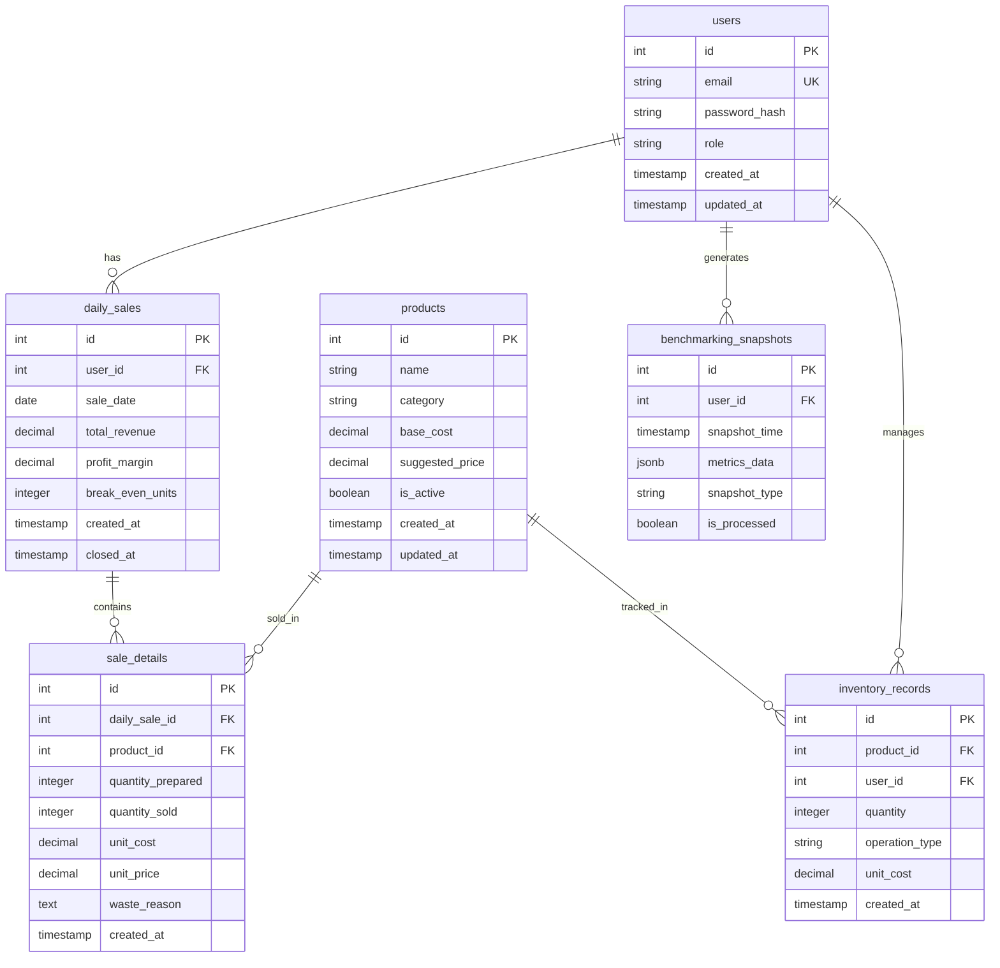

# 🗄️ **RELACIONES DE TABLAS Y NIVELES DE AISLAMIENTO - TIENDITACAMPUS**

## 🎯 **ENFOQUE EN BASE DE DATOS RELACIONAL Y TRANSACCIONES**

---

## 📋 **ÍNDICE**

1. **Diagrama Entidad-Relación**
2. **Relaciones entre Tablas (Detallado)**
3. **Niveles de Aislamiento en PostgreSQL**
4. **Transacciones ACID**
5. **Casos de Uso Prácticos**
6. **Optimización de Concurrencia**
7. **Preguntas de Examen**

---

## 🏗️ **DIAGRAMA ENTIDAD-RELACIÓN**



---

## 🔗 **RELACIONES ENTRE TABLAS - DETALLADO**

### **1. USERS → DAILY_SALES (One-to-Many)**

```sql
-- Tabla principal
CREATE TABLE users (
    id SERIAL PRIMARY KEY,
    email VARCHAR(255) UNIQUE NOT NULL,
    password_hash VARCHAR(255) NOT NULL,
    role VARCHAR(50) DEFAULT 'vendor',
    created_at TIMESTAMP DEFAULT CURRENT_TIMESTAMP,
    updated_at TIMESTAMP DEFAULT CURRENT_TIMESTAMP
);

-- Tabla relacionada
CREATE TABLE daily_sales (
    id SERIAL PRIMARY KEY,
    user_id INTEGER NOT NULL REFERENCES users(id) ON DELETE CASCADE,
    sale_date DATE NOT NULL,
    total_revenue DECIMAL(10,2) DEFAULT 0,
    profit_margin DECIMAL(5,2) DEFAULT 0,
    break_even_units INTEGER DEFAULT 0,
    created_at TIMESTAMP DEFAULT CURRENT_TIMESTAMP,
    closed_at TIMESTAMP,
    
    -- Índice para rendimiento
    CONSTRAINT unique_user_date UNIQUE(user_id, sale_date)
);

-- Índice optimizado
CREATE INDEX idx_daily_sales_user_date 
ON daily_sales(user_id, sale_date DESC);
```

**¿Por qué esta relación?**
- **Un usuario** puede tener **múltiples ventas diarias**
- **ON DELETE CASCADE**: Si se elimina usuario, se eliminan sus ventas
- **UNIQUE constraint**: Un usuario solo puede tener una venta por día
- **Índice compuesto**: Optimiza consultas por usuario y fecha

---

### **2. DAILY_SALES → SALE_DETAILS (One-to-Many)**

```sql
CREATE TABLE sale_details (
    id SERIAL PRIMARY KEY,
    daily_sale_id INTEGER NOT NULL REFERENCES daily_sales(id) ON DELETE CASCADE,
    product_id INTEGER NOT NULL REFERENCES products(id) ON DELETE RESTRICT,
    quantity_prepared INTEGER NOT NULL DEFAULT 0,
    quantity_sold INTEGER NOT NULL DEFAULT 0,
    unit_cost DECIMAL(10,2) NOT NULL,
    unit_price DECIMAL(10,2) NOT NULL,
    waste_reason TEXT,
    created_at TIMESTAMP DEFAULT CURRENT_TIMESTAMP,
    
    -- Constraints de negocio
    CONSTRAINT chk_quantity CHECK (quantity_sold <= quantity_prepared),
    CONSTRAINT chk_positive CHECK (quantity_prepared >= 0 AND quantity_sold >= 0)
);

-- Índice para análisis de productos
CREATE INDEX idx_sale_details_product_date 
ON sale_details(product_id, daily_sale_id);
```

**¿Por qué esta relación?**
- **Una venta diaria** tiene **múltiples detalles de productos**
- **ON DELETE CASCADE**: Si se elimina venta, se eliminan detalles
- **ON DELETE RESTRICT**: No se puede eliminar producto si tiene ventas
- **Constraints**: Validación de lógica de negocio

---

### **3. PRODUCTS → SALE_DETAILS (One-to-Many)**

```sql
CREATE TABLE products (
    id SERIAL PRIMARY KEY,
    name VARCHAR(255) NOT NULL,
    category VARCHAR(100) NOT NULL,
    base_cost DECIMAL(10,2) NOT NULL,
    suggested_price DECIMAL(10,2) NOT NULL,
    is_active BOOLEAN DEFAULT true,
    created_at TIMESTAMP DEFAULT CURRENT_TIMESTAMP,
    updated_at TIMESTAMP DEFAULT CURRENT_TIMESTAMP
);

-- Vista materializada para rendimiento
CREATE MATERIALIZED VIEW vw_product_performance AS
SELECT 
    p.id,
    p.name,
    p.category,
    COUNT(sd.id) as total_sales,
    SUM(sd.quantity_sold) as total_units_sold,
    AVG(sd.unit_price) as avg_selling_price,
    SUM(sd.total_revenue) as total_revenue,
    -- Métricas calculadas
    (AVG(sd.unit_price) - p.base_cost) / p.base_cost * 100 as avg_profit_margin
FROM products p
LEFT JOIN sale_details sd ON p.id = sd.product_id
GROUP BY p.id, p.name, p.category, p.base_cost;

-- Índice en vista materializada
CREATE INDEX idx_vw_product_performance_revenue 
ON vw_product_performance(total_revenue DESC);
```

**¿Por qué esta relación?**
- **Un producto** puede aparecer en **múltiples ventas**
- **Vista materializada**: Optimiza análisis de rendimiento
- **Métricas calculadas**: Profit margins, totales, promedios

---

### **4. PRODUCTS → INVENTORY_RECORDS (One-to-Many)**

```sql
CREATE TABLE inventory_records (
    id SERIAL PRIMARY KEY,
    product_id INTEGER NOT NULL REFERENCES products(id) ON DELETE CASCADE,
    user_id INTEGER NOT NULL REFERENCES users(id) ON DELETE CASCADE,
    quantity INTEGER NOT NULL,
    operation_type VARCHAR(20) NOT NULL CHECK (operation_type IN ('IN', 'OUT', 'ADJUST')),
    unit_cost DECIMAL(10,2),
    created_at TIMESTAMP DEFAULT CURRENT_TIMESTAMP,
    
    -- Constraint de lógica
    CONSTRAINT chk_quantity_operation CHECK (
        (operation_type = 'IN' AND quantity > 0) OR
        (operation_type = 'OUT' AND quantity > 0) OR
        (operation_type = 'ADJUST' AND quantity >= 0)
    )
);

-- Índice para tracking de inventario
CREATE INDEX idx_inventory_product_user 
ON inventory_records(product_id, user_id, created_at DESC);

-- Función para calcular stock actual
CREATE OR REPLACE FUNCTION calculate_current_stock(p_product_id INTEGER, p_user_id INTEGER)
RETURNS INTEGER AS $$
DECLARE
    current_stock INTEGER;
BEGIN
    SELECT COALESCE(SUM(
        CASE WHEN operation_type = 'IN' THEN quantity
        WHEN operation_type = 'OUT' THEN -quantity
        WHEN operation_type = 'ADJUST' THEN quantity
        END
    ), 0) INTO current_stock
    FROM inventory_records
    WHERE product_id = p_product_id AND user_id = p_user_id;
    
    RETURN current_stock;
END;
$$ LANGUAGE plpgsql;
```

**¿Por qué esta relación?**
- **Un producto** tiene **múltiples movimientos de inventario**
- **Operaciones tipificadas**: IN (entrada), OUT (salida), ADJUST (ajuste)
- **Función de stock**: Cálculo en tiempo real de inventario
- **Índice temporal**: Optimiza consultas históricas

---

### **5. USERS → INVENTORY_RECORDS (One-to-Many)**

```sql
-- Restricción adicional para consistencia
ALTER TABLE inventory_records 
ADD CONSTRAINT fk_inventory_user 
FOREIGN KEY (user_id) REFERENCES users(id) ON DELETE CASCADE;

-- Trigger para actualización automática
CREATE OR REPLACE FUNCTION update_product_timestamp()
RETURNS TRIGGER AS $$
BEGIN
    UPDATE products 
    SET updated_at = CURRENT_TIMESTAMP 
    WHERE id = NEW.product_id;
    RETURN NEW;
END;
$$ LANGUAGE plpgsql;

CREATE TRIGGER trg_update_product_timestamp
AFTER INSERT ON inventory_records
FOR EACH ROW
EXECUTE FUNCTION update_product_timestamp();
```

**¿Por qué esta relación?**
- **Un usuario** gestiona **múltiples registros de inventario**
- **Trigger automático**: Actualiza timestamp del producto
- **Auditoría completa**: Quién modificó qué y cuándo

---

### **6. USERS → BENCHMARKING_SNAPSHOTS (One-to-Many)**

```sql
CREATE TABLE benchmarking_snapshots (
    id SERIAL PRIMARY KEY,
    user_id INTEGER NOT NULL REFERENCES users(id) ON DELETE CASCADE,
    snapshot_time TIMESTAMP NOT NULL DEFAULT CURRENT_TIMESTAMP,
    metrics_data JSONB NOT NULL,
    snapshot_type VARCHAR(50) DEFAULT 'performance',
    is_processed BOOLEAN DEFAULT false,
    
    -- Índice para búsquedas temporales
    CONSTRAINT chk_snapshot_type CHECK (snapshot_type IN ('performance', 'export', 'backup'))
);

CREATE INDEX idx_benchmarking_user_time 
ON benchmarking_snapshots(user_id, snapshot_time DESC);

-- Índice GIN para JSONB
CREATE INDEX idx_benchmarking_metrics_gin 
ON benchmarking_snapshots USING GIN(metrics_data);
```

**¿Por qué esta relación?**
- **Un usuario** genera **múltiples snapshots de benchmarking**
- **JSONB**: Almacenamiento flexible de métricas
- **Índice GIN**: Búsqueda rápida en datos JSON
- **Timestamp tracking**: Análisis temporal de rendimiento

---

## 🔒 **NIVELES DE AISLAMIENTO EN POSTGRESQL**

### **📊 ¿Qué son los Niveles de Aislamiento?**

Son mecanismos que controlan cómo las transacciones interactúan entre sí para mantener la integridad de los datos.

### **🎯 Niveles Disponibles en PostgreSQL:**

#### **1. READ UNCOMMITTED (No soportado)**
```sql
-- PostgreSQL lo eleva automáticamente a READ COMMITTED
SET TRANSACTION ISOLATION LEVEL READ UNCOMMITTED;
-- → Se convierte en READ COMMITTED
```

#### **2. READ COMMITTED (Por defecto)**
```sql
-- Configuración por defecto en PostgreSQL
SET TRANSACTION ISOLATION LEVEL READ COMMITTED;

-- Ejemplo de comportamiento
BEGIN;
-- Transacción 1
UPDATE daily_sales SET total_revenue = 1000 WHERE id = 1;
-- En este punto, otras transacciones NO ven este cambio

COMMIT; -- Solo después del COMMIT otras transacciones ven el cambio
```

**Características:**
- ✅ **Evita lecturas sucias** (dirty reads)
- ❌ **Permite lecturas no repetibles** (non-repeatable reads)
- ❌ **Permite lecturas fantasma** (phantom reads)

#### **3. REPEATABLE READ**
```sql
SET TRANSACTION ISOLATION LEVEL REPEATABLE READ;

-- Ejemplo de comportamiento
BEGIN;
SET TRANSACTION ISOLATION LEVEL REPEATABLE READ;

-- Transacción 1: Lee datos
SELECT total_revenue FROM daily_sales WHERE id = 1;
-- Retorna: 500

-- Mientras tanto, Transacción 2:
UPDATE daily_sales SET total_revenue = 1000 WHERE id = 1;
COMMIT;

-- Transacción 1: Vuelve a leer
SELECT total_revenue FROM daily_sales WHERE id = 1;
-- Retorna: 500 (mismo valor, consistente)

COMMIT;
```

**Características:**
- ✅ **Evita lecturas sucias**
- ✅ **Evita lecturas no repetibles**
- ❌ **Permite lecturas fantasma**

#### **4. SERIALIZABLE (Más estricto)**
```sql
SET TRANSACTION ISOLATION LEVEL SERIALIZABLE;

-- Ejemplo de comportamiento
BEGIN;
SET TRANSACTION ISOLATION LEVEL SERIALIZABLE;

-- Transacción 1
SELECT * FROM daily_sales WHERE user_id = 1;
-- Retorna 10 registros

-- Mientras tanto, Transacción 2
INSERT INTO daily_sales (user_id, total_revenue) VALUES (1, 500);
COMMIT;

-- Transacción 1: Vuelve a consultar
SELECT * FROM daily_sales WHERE user_id = 1;
-- Retorna 10 registros (sin el nuevo registro)
-- Si intenta insertar, podría causar error de serialización

COMMIT;
```

**Características:**
- ✅ **Evita lecturas sucias**
- ✅ **Evita lecturas no repetibles**
- ✅ **Evita lecturas fantasma**
- ⚠️ **Puede causar errores de serialización**

---

## ⚡ **TRANSACCIONES ACID EN TIENDITACAMPUS**

### **🔒 Atomicidad (Atomicity)**
```sql
-- Ejemplo: Crear venta con detalles
BEGIN;

-- 1. Insertar venta principal
INSERT INTO daily_sales (user_id, sale_date, total_revenue)
VALUES (1, CURRENT_DATE, 0) RETURNING id;

-- 2. Insertar detalles (varios productos)
INSERT INTO sale_details (daily_sale_id, product_id, quantity_sold, unit_price)
VALUES (1, 1, 5, 10.50), (1, 2, 3, 8.75);

-- 3. Actualizar inventario
UPDATE inventory_records 
SET quantity = quantity - 5 
WHERE product_id = 1 AND user_id = 1;

-- Si algo falla, todo se revierte automáticamente
COMMIT; -- o ROLLBACK si hay error
```

### **🔄 Consistencia (Consistency)**
```sql
-- Constraint que garantiza consistencia
ALTER TABLE sale_details 
ADD CONSTRAINT chk_profit_margin 
CHECK (unit_price >= unit_cost);

-- Trigger para mantener consistencia
CREATE OR REPLACE FUNCTION update_daily_sale_totals()
RETURNS TRIGGER AS $$
BEGIN
    UPDATE daily_sales 
    SET 
        total_revenue = (
            SELECT SUM(quantity_sold * unit_price) 
            FROM sale_details 
            WHERE daily_sale_id = NEW.daily_sale_id
        )
    WHERE id = NEW.daily_sale_id;
    RETURN NEW;
END;
$$ LANGUAGE plpgsql;

CREATE TRIGGER trg_update_sale_totals
AFTER INSERT OR UPDATE ON sale_details
FOR EACH ROW
EXECUTE FUNCTION update_daily_sale_totals();
```

### **🚀 Aislamiento (Isolation)**
```sql
-- Transacción de venta con aislamiento REPEATABLE READ
BEGIN;
SET TRANSACTION ISOLATION LEVEL REPEATABLE READ;

-- Bloquear fila específica para evitar concurrencia
SELECT * FROM daily_sales WHERE id = 1 FOR UPDATE;

-- Realizar operaciones sabiendo que nadie más modificará esta fila
UPDATE daily_sales SET total_revenue = total_revenue + 100 WHERE id = 1;

COMMIT;
```

### **💾 Durabilidad (Durability)**
```sql
-- Configuración PostgreSQL para durabilidad
-- wal_level = replica (Write-Ahead Logging)
-- synchronous_commit = on
-- fsync = on

-- Transacción garantizada a disco
BEGIN;
INSERT INTO benchmarking_snapshots (user_id, metrics_data)
VALUES (1, '{"query_time": 45.2, "slow_queries": 3}');
COMMIT; -- Escrito a WAL y garantizado en disco
```

---

## 🎯 **CASOS DE USO PRÁCTICOS**

### **1. Venta Concurrente (Control de Concurrencia)**
```sql
-- Problema: Dos vendedores venden el mismo producto
-- Solución: Row-level locking

BEGIN;
-- Bloquear producto específico
SELECT * FROM products WHERE id = 1 FOR UPDATE;

-- Verificar stock disponible
SELECT calculate_current_stock(1, 1) as available_stock;

-- Si hay stock, proceder con venta
INSERT INTO sale_details (daily_sale_id, product_id, quantity_sold, unit_price)
VALUES (5, 1, 2, 15.00);

-- Actualizar inventario
INSERT INTO inventory_records (product_id, user_id, quantity, operation_type)
VALUES (1, 1, 2, 'OUT');

COMMIT;
```

### **2. Reporte de Fin de Mes (Aislamiento Serializable)**
```sql
-- Generar reporte consistente sin interferencias
BEGIN;
SET TRANSACTION ISOLATION LEVEL SERIALIZABLE;

-- Obtener snapshot consistente de datos
SELECT 
    u.name,
    COUNT(ds.id) as total_sales,
    SUM(ds.total_revenue) as total_revenue,
    AVG(ds.profit_margin) as avg_margin
FROM users u
LEFT JOIN daily_sales ds ON u.id = ds.user_id
WHERE ds.sale_date BETWEEN '2026-03-01' AND '2026-03-31'
GROUP BY u.id, u.name;

-- Mientras se ejecuta, otras transacciones no pueden interferir
COMMIT;
```

### **3. Actualización de Inventario Masiva (Atomicidad)**
```sql
-- Actualizar precios de categoría completa
BEGIN;

-- Actualizar productos
UPDATE products 
SET suggested_price = base_cost * 1.5 
WHERE category = 'bebidas';

-- Actualizar ventas en curso (si las hay)
UPDATE sale_details sd
SET unit_price = p.suggested_price
FROM products p
WHERE sd.product_id = p.id AND p.category = 'bebidas';

-- Todo o nada - si algo falla, todo se revierte
COMMIT;
```

---

## 🚀 **OPTIMIZACIÓN DE CONCURRENCIA**

### **1. Connection Pooling**
```typescript
// Configuración de TypeORM con connection pooling
{
  type: 'postgres',
  host: 'database',
  port: 5432,
  username: 'tienditacampus_user',
  password: 'tienditacampus_pass123',
  database: 'tienditacampus',
  extra: {
    max: 20,        // Máximo de conexiones
    min: 5,         // Mínimo de conexiones
    idle: 10000,    // Tiempo idle en ms
    acquire: 60000, // Tiempo para adquirir conexión
  }
}
```

### **2. Deadlock Detection**
```sql
-- Configuración para detectar deadlocks
SET deadlock_timeout = '1s';

-- Query para detectar deadlocks activos
SELECT 
    pid,
    state,
    query,
    wait_event_type,
    wait_event
FROM pg_stat_activity 
WHERE state = 'active' AND wait_event_type = 'lock';
```

### **3. Optimistic Concurrency Control**
```sql
-- Agregar versión para control optimista
ALTER TABLE daily_sales 
ADD COLUMN version INTEGER DEFAULT 1;

-- Update con verificación de versión
UPDATE daily_sales 
SET total_revenue = 1000, version = version + 1
WHERE id = 1 AND version = 1;

-- Si no actualiza filas, significa que otro lo modificó
-- (version cambió)
```

---

## 🎓 **PREGUNTAS DE EXAMEN**

### **❓ P1: ¿Por qué usaste ON DELETE CASCADE en daily_sales pero ON DELETE RESTRICT en products?**

**R:** 
- **daily_sales → users**: Si se elimina un usuario, sus ventas no tienen sentido sin él, por lo tanto se eliminan en cascada.
- **sale_details → products**: No se puede eliminar un producto si tiene ventas asociadas, porque rompería la integridad histórica de las ventas. Se requiere eliminar/reasignar las ventas primero.

### **❓ P2: ¿Qué nivel de aislamiento usarías para un sistema de ventas y por qué?**

**R:** Usaría **READ COMMITTED** para operaciones normales de venta porque:
- Buen balance entre consistencia y rendimiento
- Evita lecturas sucias (critical para datos financieros)
- Permite alta concurrencia (múltiples vendedores)
- Para reportes críticos usaría **SERIALIZABLE**

### **❓ P3: ¿Cómo manejas el problema del inventario negativo?**

**R:** Implemento múltiples capas de protección:
```sql
-- 1. Constraint en base de datos
ALTER TABLE inventory_records 
ADD CONSTRAINT chk_positive_quantity CHECK (quantity >= 0);

-- 2. Trigger de validación
CREATE OR REPLACE FUNCTION validate_stock()
RETURNS TRIGGER AS $$
DECLARE
    current_stock INTEGER;
BEGIN
    IF NEW.operation_type = 'OUT' THEN
        current_stock := calculate_current_stock(NEW.product_id, NEW.user_id);
        IF current_stock < NEW.quantity THEN
            RAISE EXCEPTION 'Stock insuficiente. Actual: %, Solicitado: %', 
                          current_stock, NEW.quantity;
        END IF;
    END IF;
    RETURN NEW;
END;
$$ LANGUAGE plpgsql;
```

### **❓ P4: ¿Qué es una vista materializada y por qué la usas?**

**R:** Una vista materializada es una **vista con cache persistente**:
- **Almacena resultados** de consultas complejas
- **Se actualiza** con REFRESH MATERIALIZED VIEW
- **Uso en TienditaCampus**: `vw_product_performance` para análisis de rendimiento
- **Ventajas**: Tiempos de respuesta de segundos a milisegundos

### **❓ P5: ¿Cómo garantizas ACID en operaciones complejas?**

**R:** Implemento transacciones completas con:
```sql
BEGIN;
SET TRANSACTION ISOLATION LEVEL REPEATABLE READ;

-- 1. Validar precondiciones
SELECT calculate_current_stock(p_id, u_id) >= qty;

-- 2. Bloquear recursos necesarios
SELECT * FROM products WHERE id = p_id FOR UPDATE;

-- 3. Ejecutar operaciones atómicas
INSERT INTO sale_details (...);
UPDATE inventory_records SET quantity = quantity - qty;

-- 4. Validar postcondiciones
SELECT calculate_current_stock(p_id, u_id) >= 0;

COMMIT; -- Todo o nada
```

### **❓ P6: ¿Qué pasa si dos usuarios venden el mismo producto simultáneamente?**

**R:** Implemento **row-level locking**:
```sql
-- Usuario 1
BEGIN;
SELECT * FROM products WHERE id = 1 FOR UPDATE;
-- Bloquea la fila hasta COMMIT

-- Usuario 2 (espera)
SELECT * FROM products WHERE id = 1 FOR UPDATE;
-- Espera hasta que Usuario 1 haga COMMIT
```

### **❓ P7: ¿Por qué usaste JSONB en benchmarking_snapshots?**

**R:** JSONB proporciona:
- **Flexibilidad**: Estructura variable de métricas
- **Rendimiento**: Índices GIN para búsquedas rápidas
- **Consultas**: Operadores de JSON nativos
- **Ejemplo**: `metrics_data->>'query_time' > 100`

---

## 🏆 **CONCLUSIÓN**

**TienditaCampus implementa un diseño relacional robusto con:**

- **Relaciones bien definidas** con constraints apropiados
- **Niveles de aislamiento** según el caso de uso
- **Transacciones ACID** para integridad garantizada
- **Control de concurrencia** para operaciones simultáneas
- **Optimizaciones de rendimiento** con vistas materializadas

**Este diseño enterprise garantiza consistencia, rendimiento y escalabilidad para operaciones comerciales críticas.** 🚀
